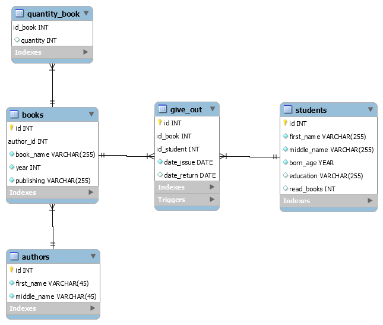

# Тестовое задание для стажеров аналитиков-технологов


Необходимо разработать некоторые части приложения для учета книг в библиотеке. Описание
данных, с которыми будет работать приложение – ниже.

Приложение для учета книг в библиотеке должно:

1. Хранить названия книг, ФИО авторов, наименования издательств, год издания.
2. Учитывать имеющиеся в библиотеке экземпляры конкретной книги.
3. Учитывать студентов, которым выдавалась конкретная книга. При каждой выдаче
книги студенту, фиксируется дата выдачи. При возврате – дата возврата книги.

## Задания:
1. Опишите модель данных (в любом удобном для вас представлении) для обслуживания
библиотеки. Это может быть описание таблиц с типами данных, диаграмма – что угодно.





2. Напишите SQL-запрос, который бы возвращал самого популярного автора за год. Запрос
должен основываться на модели данных, которую вы описали в задании 1


```SQL
SELECT * 
FROM 
test_ex.authors
WHERE
authors.id = (SELECT 
	books.author_id
	FROM 
	books, give_out
	WHERE 
	give_out.id_book = books.id AND give_out.date_issue > DATE_ADD(CURDATE(), INTERVAL -1 YEAR)
	GROUP BY 
	books.author_id	
	ORDER BY
	COUNT(books.author_id) 
	DESC LIMIT 1)

```

3. Определите понятие «злостный читатель». Предложите алгоритм для поиска самого
злостного читателя библиотеки. На любом языке программирования опишите алгоритм
поиска такого читателя. Алгоритм должен основываться на модели данных, которую вы
описали в задании 1

Определение злостного читателя достигается путем вывода самого большого значения в таблице STUDENT колонке read_books. В данном столбце хранится количество прочитанных книг студентом за все время. Изменение значений в данной колонке достигается с помощью триггера

```SQL
CREATE DEFINER=`root`@`localhost` TRIGGER `give_out_AFTER_INSERT` AFTER INSERT ON `give_out` 
	FOR EACH ROW BEGIN
	UPDATE test_ex.students
    SET 
		students.read_books = students.read_books + 1 
    WHERE
		NEW.id_student = students.id;
END
```


```python
import mysql.connector
from mysql.connector import Error

def create_connection(host_name, user_name, user_password, db_name):
    connection = None
    try:
        connection = mysql.connector.connect(
            host=host_name,
            user=user_name,
            passwd=user_password,
            database=db_name
        )
        print("Connection to MySQL DB successful")
    except Error as e:
        print(f"The error '{e}' occurred")

    return connection

def execute_read_query(connection, query):
    cursor = connection.cursor()
    result = None
    try:
        cursor.execute(query)
        result = cursor.fetchall()
        return result
    except Error as e:
        print(f"The error '{e}' occurred")


connection = create_connection("localhost", "root", "root", "test_ex")    

sql = """
    SELECT
        first_name, middle_name, read_books 
    FROM 
        test_ex.students
    ORDER BY
        read_books  
    DESC LIMIT 1  
"""

users = execute_read_query(connection, sql)


for user in users:
    print(user)
```    